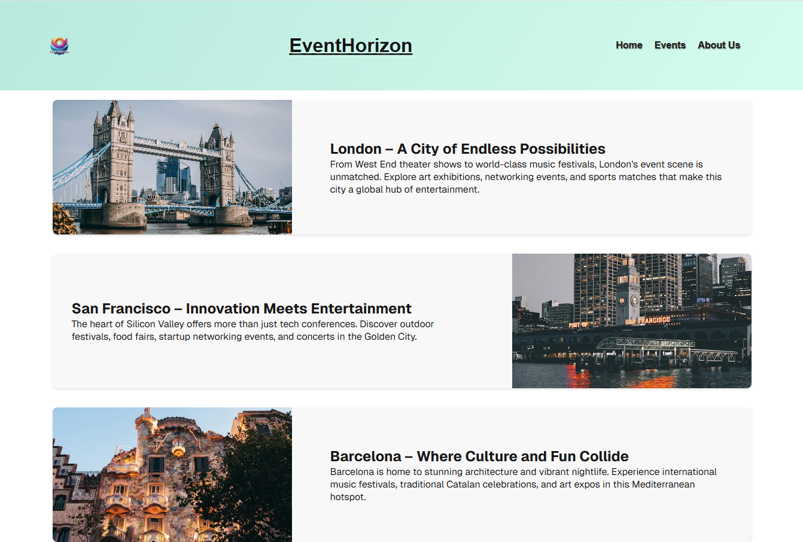

# EventHorizon

EventHorizon is a web application that allows users to browse events around the world and register for them if interested. The platform provides an intuitive interface to explore various events and manage registrations effortlessly.

## :trophy: Badges
 

## Features

Browse global events by categories and locations

Register for events with email authentication

Responsive UI for seamless experience across devices

Fast performance with Next.js and React 19

## Tech Stack

Frontend: Next.js 15, React 19, React DOM 19

Backend: API routes using Next.js

Styling: CSS

## Deployment: Vercel (link will be provided after deployment)
[Deployed Application](https://bordanattila.github.io/EventHorizon/)

## Installation

To get started with EventHorizon, follow these steps:

### Clone the repository
`git clone` <repository_url>
`cd EventHorizon`

### Install dependencies
`npm install`

### Start the development server
`npm run dev`

#### Scripts

The following scripts are available:

    `npm run dev` - Starts the development server using Next.js with Turbopack.

    `npm run build` - Builds the production-ready application.

    `npm run start `- Runs the application in production mode.

    `npm run lint` - Runs ESLint to check for code issues.

#### Dependencies

    "dependencies": {
        "next": "15.1.7",
        "react": "^19.0.0",
        "react-dom": "^19.0.0"
    },
    "devDependencies": {
        "@eslint/eslintrc": "^3",
        "@types/node": "^20",
        "@types/react": "^19",
        "@types/react-dom": "^19",
        "eslint": "^9",
        "eslint-config-next": "15.1.7",
        "typescript": "^5"
    }

## Screenshots

For any questions or issues, feel free to reach out!
